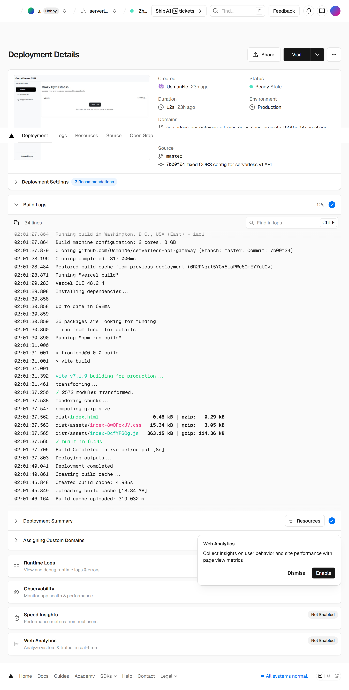

# Serverless CRUD Frontend (React + Vite)

## Deployment Pipeline Screenshot


This is the frontend for a Full-Stack REST API application running on AWS. The backend is a Serverless Framework application with AWS API Gateway, Lambda, and DynamoDB. The frontend connects to the backend REST API and provides full CRUD (Create, Read, Update, Delete) functionality.

---

## 🚀 Features

- **React (Vite)** for a fast development environment.
- **React-Bootstrap ** for responsive, modern UI design (no custom CSS required).
- **CRUD operations** against the backend API:

  - Create a new item
  - View all items
  - Update existing items
  - Delete items

- **Responsive design** supporting at least 4 breakpoints (mobile, tablet, small desktop, large desktop).
- Environment variable configuration for different backend stages (dev/prod).

---

## 📂 Project Structure

```
frontend/
├── src/
│   ├── api/             # API communication logic
│   │   └── api.js       # Central fetch wrapper for backend API
│   ├── components/      # Reusable UI components (e.g., Button, Card)
│   ├── layout/          # Page structure components
│   │   ├── Header.jsx
│   │   └── Sidebar.jsx
│   ├── pages/           # Full-page components (e.g., routing targets)
│   │   └── HomePage.jsx
│   ├── utils/           # Helper functions, constants, validation
│   ├── App.jsx          # Main application component/router setup
│   ├── main.jsx         # React entry point (mounts App)
│   └── index.css        # Global styles (including Bootstrap imports)
├── public/              # Static assets
│   └── index.html       # Main HTML file (Vite injection point)
├── package.json
├── vite.config.js
├── .env.production      # production environment variables
└── .env.development     # development environment variables
```

---

## ⚙️ Setup & Installation

### 1. Clone repository

```bash
git clone <https://github.com/UsmanNe/serverless-api-gateway.git>
cd frontend
```

### 2. Install dependencies

Using **npm**:

```bash
npm install
```

Or using **yarn**:

```bash
yarn install
```

### 3. Environment variables

Create `.env.production`and `.env.development` and set the API base URL (from your deployed backend):

```
VITE_API_BASE_URL=https://your-api.execute-api.us-east-1.amazonaws.com/dev
```

### 4. Run development server

```bash
npm run dev
```

Visit: [http://localhost:5173](http://localhost:5173)

### 5. Build for production

```bash
npm run build
```

The build output is in the `dist/` folder. Deploy this folder to your hosting platform (Vercel, Netlify, AWS S3/CloudFront, etc.).

---

## 🖼️ UI Components

- **UserForm**: Add new user.
- **UserList**: edit, and delete user.
- **EditModal**: Update existing user with a Bootstrap modal.

---

## 🌍 Deployment

- **Vercel/Netlify**: Connect GitHub repo, set `VITE_API_BASE_URL` as environment variable, and auto-deploy on push.
- **AWS S3 + CloudFront**: Upload `dist/` build folder, configure CloudFront distribution.
- **GitHub Pages**: Publish `dist/` folder (requires config).

---

## 🔗 Tech Stack

- **Frontend Framework**: React 18 with Vite
- **Styling**: React-Bootstrap
- **Backend API**: AWS API Gateway + Lambda + DynamoDB (Serverless Framework)
- **CI/CD (optional)**: GitHub Actions + Netlify/Vercel for frontend; GitHub Actions + Serverless deploy for backend

---

## 📹 Demo & Docs

- Backend repo link: _(https://github.com/UsmanNe/serverless-api-gateway/tree/master/backend)_
- Frontend deployment URL: _(https://serverless-api-gateway.vercel.app/)_

---

## ✅ Requirements covered

- [x] React frontend with CRUD operations
- [x] Modern responsive design with Bootstrap
- [x] Supports multi-device screen sizes
- [x] Ready for CI/CD deployment

---

## 📝 License

MIT License
